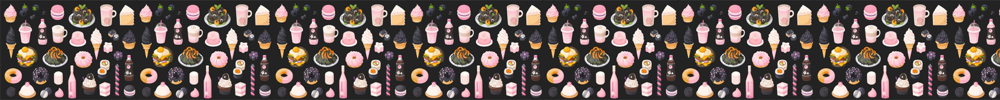
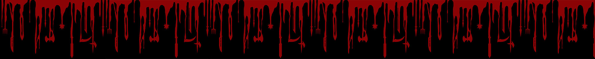

# DBS Zadanie 4

Tutorial na WorkBench:
https://www.youtube.com/watch?v=7Pwj7nV-oRM

#### Meno hry napady 
(akoze je jedno ake meno to bude mat meno len ma napadli nejake blbosti tak treba vybrat jedno :D )  
Gods of the hunt (GOTH)  
Hunt of the year (HOTY)  
Queens of the century (QOTC)  
Hunters and prey (HAP)

Veci co treba dorobit
==========
 - Neviem ako sa ukladaju hesla do databazy zatial som tam dala iba ze password

 

## Registracia
##### EMAIL
 - email (overenie cez potvrdzovacie tlacidlo)
 - Pouzivatelske meno
 - realne meno a priezvisko
 - Heslo (min 8znakov, 1 uppercase, 1cislo, 1specialny znak)
##### FACEBOOK
 - aplikacia si vytiahne z FB meno a email
 - pouzivatelske meno
 - heslo
 - https://developers.facebook.com/docs/games/gaming-services/login/
 - https://developers.facebook.com/docs/games/gaming-services/enroll
##### GOOGLE
 - vytiahne si meno a email
 - pouzivatelske meno
 - heslo  
 - https://www.itsolutionstuff.com/post/php-and-mysql-login-with-google-account-exampleexample.html

  

Každý používateľ môže mať jeden alebo viac charakterov
 > _**USERS**_ = id, meno AS name, priezvisko AS last_name, email, overenie (1/0) AS verification, napojenie facebook as Facebook, napojenie google AS Google, odkaz na zahashovanu tabulku hesiel AS password  

### Characters

Pri vytváraní charakterov si používateľ musí vybrať rolu z listu. Každá rola má dostupné iné úlohy a iné objekty. V tabulke characters sa ukladajú súradnice o polohe pouzívateľa na základe čoho sa určuje blízkosť ostatných používateľov a príšer. 
 > _**CHARACTERS**_ = id, userID, exp, roleID, level, lives, attack_number, defense_number, coordinates_x, coordinates_y, areaID

### Roles 

Používateľ si môže vybrať zo zoznamu rolí. Každá rola má iný počet levelov potrebných na dosiahnutie levela s bossom. Medzi role patria:
 - Collector = na posun v leveloch a získanie exp musí postava pozbierať špecifické objekty
 - Warrior = na posun v leveloch musí poraziť čo najviac spoluhráčov
 - Monster Slayer = na posun v leveloch musí zabiť čo najviac príšer
 - Explorer = na posun v leveloch musí zabiť príšeru z každého druhu a pozbierať objekty z každého druhu
 - Adventurer = musi splnit najviac uloh co ho dostane do ciela  

 - . Treba doplniť a upravit tie role alebo upravit  

 > _**ROLES_LIST**_ = id, level_exp, max_level, level_lives_increase, level_attack_number_increase, level_defense_number_increase

### Abilities  

Podľa výberu role si používateľ vyberie schopnosť.
 - Collector = 2 * lives, 1/2 * attack_number, 2 * defense_number, 5/3 * rýchlosť pohybu, mapa blízkeho okolia na ktorej vidí objekty blízko neho
 - Warrior = 3 * lives, 4/3 * attack_number, viac možností objektov zbraní
 - Monster Slayer = 4/3 * attack_number, 5/3 * rýchlosť pohybu, viac možností objektov zbraní
 - Explorer = 2 * lives, 5/3 * rýchlosť pohybu, mapa blízkeho okolia na ktorej vidí objekty blízko neho
 - Adventurer = 
 > _**ABILITY_LIST**_ = id, roleID, level, prerequired_abilityID

 > _**ABILITIES**_ = id, abilityID, characterID

  
## Priatelstva
Používatelia môžu nadväzovať priateľstvá. Keďže usernames sú unikátne tak si vedia vuhľadať podľa pouívateľského mena svojho spoluhráča a poslať mu žiadosť o priateľstvo a následne spolupracovať a  vytvárať tímy. Pokiaľ má používateľ raz zamiestnutú pozvnánku na priateľstvo, už nevie poslať ďalšiu danému používateľovi.

 > _**FRIENDSHIPS**_ = id, userID_sender, userID_reciever, accepted (1/0),  rejected (1/0), ended (1/0), datetime as requested_at

  
## Timy
Používateľ sa môže rozhodnúť vytvoríť tím a pozvať do neho svojich priateľov. Týmto sa stane adminom tímu a je automaticky priradený to tabuľky teammates s parametrom accepted. Ak používateľ ktorý dostane pozvánku ju príjme tak je v tabuľke "teammates" vytvorený záznam z jeho ID. 

 > _**TEAMS**_ = id, adminID, name, icon

 > _**TEAMMATES**_ = id, teamID, userID, created_at, accepted, rejected, ended

  
## Chat
Pocas hrania hry mozu pouzivatelia pouzivat chat. Pouzivatelia mozu chatovat iba so svojimi priatelmi alebo so svojim timom.

 > _**MESSAGES**_: id, userID_sender, userID_reciever, teamID_reciever, text, created_at

  
## Ignore list
Používateľ má možnosť zablokovať druhého používateľa ktorý mu už nebude schopný posielať žiadosti alebo správy.  
Reciever je ten ktory je zablokovany a sender je ten co zablokoval recievera.

 > _**IGNORE_LIST**_ = id, userID_sender, userID_reciever, created_at

  
## Monsters
V hre sa nachádzajú príšery rôznych druhov. Každá príšera má svoje meno a rozsah levelov na ktorých sa zobrazuje používateľovi. Medzi príšery patria napríklad:

 #### **Anger Minion **
  - Explodujúci poskokovia, ktorí sú tvorení z kameňov, ktoré drží magma pokope. Dokážu vypľúvať magmu na svojich nepriateľov. Minions sú jedny z najslabších bojovníkov a je možné ich zničiť úderom zbraňou Sacred Cross. 
 #### **Behemoth** 
  - Obrovský slon, ktorý dokázal nasať celú rieku a nasledne sa chrániť a útočiť silným prúdom vody. Je ťažšie ho premôcť pretože je priam nemožné na Behemota útočiť tvárov v tvár, je potrebné sa mu vyhnúť a dostať sa do pozície, kde nedokáže postavu zasiahnuť prúdom vody a vtedy ju je možné zničiť.
 #### **Apep** 
  - Obrovský had s jedovatými tesákmi, ktoré pri zasiahnutí znamenajú stratu jedného života, taktiež je náročné zničiť hada, keďže pri dotyku jeho kože stratíte 25% života. Avšak hada je možné zabiť iba obetovaním časti života a následným presným zasahom hada. 
 #### **Ophanim** 
  - Diablovi anjeli, ktorí dokáyali vidieť cez každý objekt pred nimi a preto ich bolo možné zničiť iba útokom zozadu.
 #### **Gluttony Minions** 
  - Útočili v skupinách a po ich zničení vybuchli a zanechali za sebou kaluž zelenej tekutiny, pri vstupe do tejto tekutiny prídete o 30% života a kaluž ostáva po dobu 3s. Je možné ich zničiť využitím immortality pointion, ktorá dovolí postave chodiť cez kaluže. 
 #### **Gorger Worm** 
  - Ich pozornosť úputaš až keď sa  If an unwary victim moves close to its burrow, they instantly rise up and attempt to devour it. They rise from the ground when you lures them out from the dusty area, trying to snap you.
 #### **Glutton** 
  - Obézne bytosti s čeľusťami namiesto rúk a ochabnutými ústami na na krku. Požierajú všetko čo im príde do cesty a je možné ich zabiť iba pomocou zbrane Scythe.
 #### **Hoarder/Waster** 
  - dvojica duší, ktorá počas života žila v blahobyte, ktorý premrhala, sa teraz pretavila do stvorenia, ktoré sa hojdá v kruhu a hádže mince, keď sú v ohrození. Na porazenie je potrebný štít(??nová zbraň??), ktorý odrazí mince a pomôže sa dostať k monštru. 
 #### **Greed Minion** 
  - mimoriadne rýchle a úhybné monštrá, ktoré vyzerajú , že sa trblietajú ako zlato. Skáču tam a späť pred pokusom o útok
 #### **Throne Demon** 
  - majú pozlátené brnenie a sú vyzbrojené štítom v jednej ruke a masívnou sekerou v druhej
 #### **Fire guardian** 
  - Pokiaľ je toto monštrum vo svojej dymovej forme, sú úplne neporaziteľní pre akýkoľvek druh útoku. Iba keď sú krátko v ohni, môžu byť uhasení silným výbuchom zbrane Sacred Cross
 #### **Leviathan** 
  - dvojitý silný pancier, ktorý sa tihaol po chrbte a svalnatom tele obrovské vodného jaštera, jeho pokožka bola tvrdá ako kameň a chvost bol ukončený pevnými ostňami
 #### **Heretic**
  - čarodejníci v pekle, ich jedinou silou sú energetické štíty, ktoré môžu použiť aj na iných prisluhovačov, aby zablokovali všetku mágiu a útoky. Nie je možné ich zničiť pomocou zbrane Sacred Cross, dajú sa zničiť špeciálnou zbraňou Scythe.
 #### **Pagan**
  - kňazi, ktorí niesli palicu, ktorá mohla zaútočiť na diaľku vystreľovaním gule nabitej magickou energiou. Ichh zabitie bolo jednoduchšie ako herektikov,pretože nebola nutná žiadna špeciálna zbraň. 
 #### **Fiend**
  - vo veľkých skupinách sa objavuje veľký lietajúci netopier pokrytý rybími šupinami a jašteričý chvost so silou odpáliť neblokovateľné
 #### **Arch Demon**
  -  Okrídlený démon, ktorý je vyzbrojený párom mečov. 
 #### **Damned Crusader**
  - Ich štíty a brnenie sú rozdrobené a ich čepele už dávno zhrdzaveli.
 #### **Damned Captain**
  - Vodcovia Crusaderov, ktorí mohli svoje štíty pohltiť plameňmi, vďaka čomu by boli imunní voči útokom špeciálnej zbrane.
 #### **Malacoda** 
  - bezkrídle stvorenie obklopené štítom z plameňov, ktoré ich obklopovalo ohnivou ochranou, ktorú je možné znížiť pomocou zbrane Sacred Cross
 #### **Ice giants**
  - masívne a humanoidné tvory, ktoré sú súčasťou a obranou ľadovej brány obklopujúcej peklo. Keďže sú súčasť bránz nie sú schopné pohybu, avšak sú schopné vidieť a vyfúknuť svoj ľadový dych, ktorý dokáže zmraziť hráča na nejaký čas a pripraviť ho o polovicu života.

 > _**MONSTER_LIST**_ = id, name, start_level, end_level, prerequired_monster (references monsterID), taskID_prerequired_task, exp_reward

 > _**MONSTERS**_ = id, monsterID, lives (0 means kileld), attack_number (0 if killed), defense_number (0 if killed), coordinates (null if killed), areaID, killed_by (references characterID)

  
## Tasks
V hre sa nachadzaju ulohy ktore je splnaju postavy na postup v leveloch a ziskanie exp. Kazda rola postavy ma ine ulohy. Najviac ich ma rola typu adventurer. Medzi zakladne ulohy patria naprikad:

 - [ ] **TODO** Vymysliet nejake ulohy

 > _**TASK_LIST**_ = id, areaID, preprequired_monster_kill, prerequired_task, character_lvl, exp_reward, item_reward(REFERENCES itemsID)

 > _**TASKS**_ = id, taskID, ownerID (REFERENCES characterID), started_at, finished_at (null if not finished)

  
## Mapa
Hra sa odohrava na mape. Pouzivatelia vidia iba ostatnych pouzivatelov ktori sa nachadzaju v danej oblasti podla levelu. Kazda oblast sa teda viaze iba na prislusny level. V danej oblasti sa nachádzajú iba príšery a objekty prislúchajúce danému levelu. Medzi základné oblasti patria napríklad:

  
#### lvl.1: Limbo
  - Anger Minion 
  - Behemoth  

   
####  lvl.2: Lust
  - Apep 
  - Ophanim    

  
####  lvl.3: Gluttony
  - Gluttony Minions
  - Gorger Worm 
  - Glutton  

  
####  lvl.4: Greed
  - Hoarder/Waster
  - Greed Minion 
  - Throne Demon  

  
####  lvl.5: Anger
  - Fire guardian
  - Leviathan  

  
####  lvl.6: Heresy
  -  Heretic 
  -  Pagan 
  -  Fiend  

  
####  lvl.7: Violence
  - Arch Demon
  - Damned Crusader 
  - Damned Captain   

  
####  lvl.8: Fraud
  - Malacoda   

  
####  lvl.9: Treachery
  - Ice giants   

 > _**AREA_LIST**_ = id, level, name, matrix

  
## Objekty
Na mape sa nachadzaju objekty ktore sluzia bud na zberatelske ucely (bud na splnenie ulohy alebo naplnenie svojej role) alebo zbrane a brnenie alebo potions a amulety ktoré poskytujú používateľovi dočasné schopnosti. Medzi základné objekty patria napríklad:
Zberateľské účely:
 - Map of treasures (používateľ vidí okolo seba objekty ktoré by bez mapy nenašiel)
 - Mermaids scale (nemá špeciálnu silu) 

Zbrane a brnenie:
 - Smaugs tooth (slúži ako ochrana hlavy, 9/10 * defense_number)
 - Excalibur (2 * attack_number)
 - Schythe (nová zbraň) 
 - Shield (nová ochrana proti útoku, nevyhnutná v určitom leveli)

Potions and amulets:
 - Potion of immortality (po vypití 1minúta)
 - Potion of enemy vision (po vypití vidí použivateľ po dobu 1nej minúty okolo seba všetkých používateľov a príšery nachádzajúce sa aj za objektami v jeho blízkosti)

Starter package:
 - Sacred Cross (zbraň, ktorú má každá postava od začiatku a môže ju použiť pri útokoch na pekelné monštrá)
 > _**ITEM_LIST**_ = id, areaID, prerequired_kill (references monsterID), prerequired_task (references taskID), lives_increase, attack_number_increase, defense_number_increase, time_span (ako dlho to mozes mat u seba)

 > _**ITEMS**_ = id, ownerID (REFERENCES characterID), status (used = 1, unused=null), required_at, used_at, time_span

  
## Combat
Počas hry sa zaznamenávajú všetky udalosti na vytváranie štatistík. Vrámci zaznamenávania udalostí je relevantný údaj či sa v boji nachádza používateľ vs. pouívateľ alebo používateľ vs. príšera.   

 > _**COMBAT_LOG**_ = id, character1 (references characterID), character2 (references characterID), monster (references monsterID), areaID, winner (references characterID), started_at, finished_at

 Monster môže byť null alebo character môže byť null podľa toho komu patrí event.
 > _**COMBAT_EVENTS**_ = id, combat_logID, characterID, monster, exp_change, lives_change, created_at
